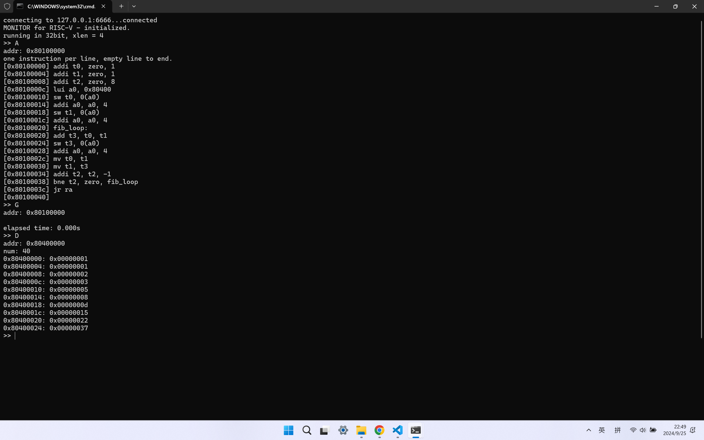
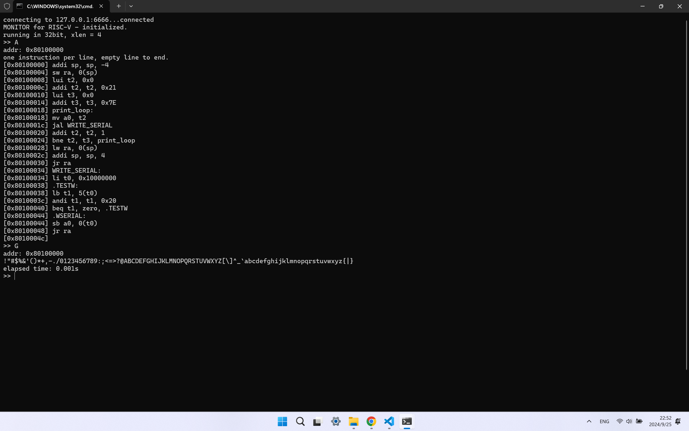
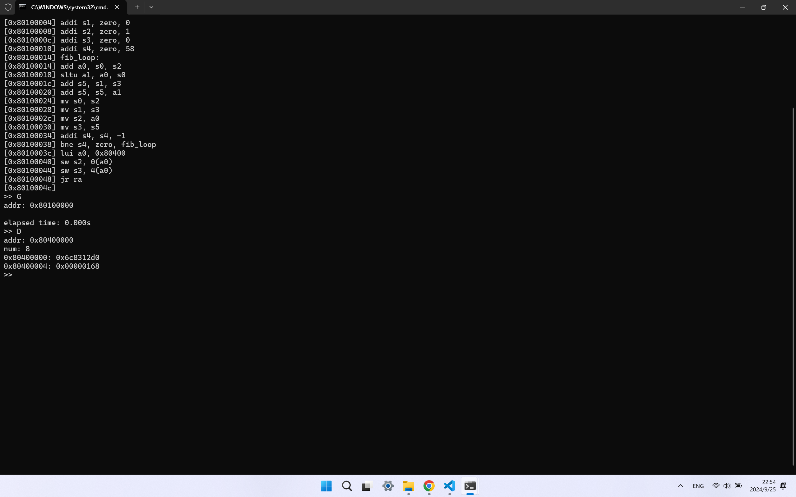

# 实验1 汇编语言与监控程序

计23 万振南

## 一、实验过程及汇编代码

**1. 编写汇编程序，求前 10 个 Fibonacci 数（前两项为 1），将结果保存到起始地址为 0x80400000 的 10 个字中，并用 D 命令检查结果正确性**

汇编代码

```assembly
addi t0, zero, 1
addi t1, zero, 1
addi t2, zero, 8
lui a0, 0x80400
sw t0, 0(a0)
addi a0, a0, 4
sw t1, 0(a0)
addi a0, a0, 4
fib_loop:
add t3, t0, t1
sw t3, 0(a0)
addi a0, a0, 4
mv t0, t1
mv t1, t3
addi t2, t2, -1
bne t2, zero, fib_loop
jr ra
```

代码解释

首先初始化前两项为 1，然后进入循环。在每次循环中，计算下一个 Fibonacci 数，并更新前两项的值。循环计数器用于控制计算次数

实验结果



**2. 编写汇编程序，将 ASCII 可见字符（0x21~0x7E）从终端输出**

汇编代码

```assembly
addi sp, sp, -4
sw ra, 0(sp)
lui t2, 0x0
addi t2, t2, 0x21
lui t3, 0x0
addi t3, t3, 0x7E
print_loop:
mv a0, t2
jal WRITE_SERIAL
addi t2, t2, 1
bne t2, t3, print_loop
lw ra, 0(sp)
addi sp, sp, 4
jr ra
WRITE_SERIAL:
li t0, 0x10000000
.TESTW:
lb t1, 5(t0)
andi t1, t1, 0x20
beq t1, zero, .TESTW
.WSERIAL:
sb a0, 0(t0)
jr ra
```

代码解释

首先设置堆栈并存储返回地址。通过循环，将每个字符传递给 WRITE_SERIAL 子程序，等待串行端口可用，并将字符输出到终端，然后继续循环，直到输出完所有字符

实验结果



**3. 编写汇编程序，求第 60 个 Fibonacci 数，将结果保存到起始地址为 0x80400000 的 8 个字节中，并用 D 命令检查结果正确性。提示：计算过程中可以用两个 32 位寄存器保存 64 位整数**

汇编代码

```assembly
addi s0, zero, 1
addi s1, zero, 0
addi s2, zero, 1
addi s3, zero, 0
addi s4, zero, 58
fib_loop:
add a0, s0, s2
sltu a1, a0, s0
add s5, s1, s3
add s5, s5, a1
mv s0, s2
mv s1, s3
mv s2, a0
mv s3, s5
addi s4, s4, -1
bne s4, zero, fib_loop
lui a0, 0x80400
sw s2, 0(a0)
sw s3, 4(a0)
jr ra
```

代码解释

利用两个 32 位寄存器分别保存 Fibonacci 数的高低位。在循环中，依次计算 Fibonacci 数，并检查是否产生进位，将进位加到高位部分。最终将高低位结果存储到指定内存地址

实验结果



## 二、代码分析报告

### 监控程序

**结构分析**

init.S:

负责系统的初始化，包括清空BSS段、设置异常处理、配置页表、初始化栈、配置串口等
初始化完成后，跳转到WELCOME标签，打印启动信息并进入SHELL

shell.S:

提供一个简单的命令行接口，允许用户与操作系统进行交互
包含命令解析和执行的逻辑

evec.S:

处理异常向量表，定义异常处理程序的入口
当发生异常时，CPU会跳转到这里定义的处理程序

test.S:

包含测试代码，用于验证系统的各个部分是否正常工作

trap.S:

处理陷阱和中断，定义中断处理程序

utils.S:

提供一些常用的工具函数或宏，供其他汇编文件使用

**程序与外部交互的流程**

**1. 读取操作符**

程序首先通过调用READ_SERIAL函数从串口读取一个操作符
根据读取到的操作符，程序执行不同的操作

**2. 操作符处理**

**'R': 打印用户空间寄存器**

- 保存当前寄存器状态
- 读取并打印用户空间寄存器的值
- 恢复寄存器状态

**'D': 打印内存内容**

- 保存当前寄存器状态
- 从串口读取内存地址和字节数
- 读取并打印指定内存地址的内容
- 恢复寄存器状态

**'A': 写入内存内容**

- 保存当前寄存器状态
- 从串口读取内存地址和字节数
- 从串口读取数据并写入指定内存地址
- 恢复寄存器状态

**'G': 跳转到用户程序执行**

- 从串口读取用户程序入口地址
- 设置用户程序入口地址到mepc寄存器
- 保存当前寄存器状态
- 跳转到用户程序执行

**'T': 打印页表**

- 保存当前寄存器状态
- 读取并打印页表内容
- 恢复寄存器状态

**3. 错误处理**

如果读取到的操作符不在上述范围内，程序会输出XLEN，用于区分RV32和RV64

**4. 交互循环**

每次操作完成后，程序会跳转回SHELL标签，等待下一次交互

### 终端程序

**结构分析**

导入模块：导入了多个标准库模块，如argparse、os、subprocess等。尝试导入serial和readline模块，如果失败则处理异常

全局变量：定义了一些全局变量，如CCPREFIX、CMD_ASSEMBLER、CMD_DISASSEMBLER、CMD_BINARY_COPY等。定义了寄存器别名列表Reg_alias。定义了地址长度变量xlen和架构变量arch

函数：

- InitializeTCP：初始化TCP连接

- InitializeSerial：初始化串行端口连接
- test_programs：测试外部程序是否可用
- MainLoop：主循环，等待用户输入命令并执行相应操作
- run_R、run_D、run_A、run_F、run_U、run_G、run_T：具体操作函数，处理与外部系统的交互
- outp.write：向外部系统发送数据
- inp.read：从外部系统读取数据

主程序：使用argparse解析命令行参数。根据参数初始化TCP或串口通信。测试必要的程序是否可用。进入主循环

**程序与外部交互的流程**

初始化连接：程序通过命令行参数决定是使用TCP连接还是串行端口连接。如果使用TCP连接，调用InitializeTCP函数，建立与指定IP地址和端口的连接。如果使用串行端口，调用InitializeSerial函数，打开指定的串行端口并设置波特率

测试外部程序：调用test_programs函数，检查必要的外部程序是否可用

主循环：程序进入MainLoop函数，等待用户输入命令。根据用户输入的命令，执行相应的操作，如读取寄存器、显示内存、写入汇编代码、反汇编代码、运行用户代码、打印页表等

数据传输：程序通过outp.write方法向外部系统发送命令和数据，通过inp.read方法从外部系统读取数据。数据传输的具体实现取决于连接类型，分别由tcp_wrapper类和serial.Serial类实现

错误处理：程序在与外部系统交互时，使用try-except块捕获和处理可能的异常，如连接失败、命令执行失败等

**具体操作函数**

**run_R**

- 向输出流写入字节 'R'
- 循环读取 1 到 31 号寄存器的值
- 将读取的值转换为整数并打印寄存器编号、别名和值

**run_D**

- 检查 num 是否是 4 的倍数，如果不是则打印错误信息并返回
- 向输出流写入字节 'D'，然后写入地址和数量
- 循环读取指定数量的字节，每次读取 4 个字节
- 将读取的值转换为双字并打印地址和值

**run_A**

- 打印提示信息
- 初始化汇编代码字符串并设置偏移量
- 循环读取用户输入的汇编指令或十六进制数
- 将输入的内容添加到汇编代码字符串中
- 将汇编代码转换为二进制并写入输出流

**run_F**

- 检查文件是否存在，如果不存在则打印错误信息并返回
- 打印读取文件的提示信息
- 初始化汇编代码字符串并设置偏移量
- 循环读取文件中的每一行，将其添加到汇编代码字符串中
- 将汇编代码转换为二进制并写入输出流

**run_U**

- 检查 num 是否是 4 的倍数，如果不是则打印错误信息并返回
- 向输出流写入字节 'D'，然后写入地址和数量
- 循环读取指定数量的字节，每次读取 4 个字节
- 将读取的值转换为双字并反汇编，打印地址、值和反汇编结果

**run_G**

- 向输出流写入字节 'G'，然后写入地址
- 定义一个 TrapError 异常类和一个 trap 函数，用于处理陷阱异常
- 读取返回值并检查是否有异常发生
- 如果没有异常，开始计时并循环读取输出，直到读取到结束标记
- 打印执行时间或异常信息

**run_T**

- 向输出流写入字节 'T'
- 读取地址并检查分页是否启用
- 打印页表信息
- 根据地址长度不同，分别处理 32 位和 64 位地址的页表
- 循环读取页表项并打印虚拟地址和物理地址的映射关系

## 三、思考题

**1. 比较 RISC-V 指令寻址方法与 x86 指令寻址方法的异同**

**相同点**

两者都支持通过寄存器进行寻址，允许直接访问寄存器中的数据。都允许在指令中嵌入立即数，便于进行常量操作。都支持基于偏移量的寻址方法，如基址加偏移量的寻址

**不同点**

寻址模式的数量：

- x86：拥有更复杂的寻址模式，包括基址寻址、变址寻址、基址加变址寻址等
- RISC-V：相对简单，主要采用固定的几种寻址模式，如立即数、寄存器、基址加偏移等

指令长度：

- x86：指令长度可变，指令格式复杂，寻址模式通常在指令中包含多个部分
- RISC-V：指令长度固定为32位

有效地址计算：

- x86：有效地址的计算涉及多个寄存器和复杂的偏移量组合
- RISC-V：有效地址的计算相对简单，通常只涉及一个基址寄存器和一个简单的立即数偏移

**2. 阅读监控程序，列出监控程序的 19 条指令，请根据自己的理解对用到的指令进行分类，并说明分类原因**

算术运算指令：ADD, ADDI, AND, ANDI, OR, ORI, SLLI, SRLI, XOR，这些指令都是用于执行基本的算术或逻辑运算，处理数据并修改寄存器的值

控制流指令：BEQ, BNE, JAL, JALR，这些指令用于控制程序的执行流，例如条件跳转和无条件跳转

加载和存储指令：LB, LW, SB, SW，这些指令用于内存和寄存器之间的数据传输，包括加载和存储操作

特殊立即数指令：AUIPC, LUI，处理带有立即数的操作，且涉及地址计算

**3. 结合 term 源代码和 kernel 源代码说明 term 是如何实现用户程序计时的**

run_G 函数首先向输出流（outp）写入一个字节 b'G'，表示启动用户程序。然后，它将用户程序的起始地址转换为字节串并写入输出流

定义了一个内部类 TrapError 用于捕获和处理异常。定义了一个内部函数 trap，当接收到异常信号时，读取异常信息并抛出 TrapError 异常

使用 timeit 模块的 timer 函数记录程序开始执行的时间 time_start

通过循环读取输入流（inp）的返回值，判断程序的执行状态
- 如果接收到 b'\x07'，表示程序正常结束，跳出循环
- 如果接收到 b'\x81'，表示程序超时被杀死，打印相应信息并跳出循环
- 如果接收到 b'\x80'，调用 trap 函数处理异常
其他情况下，将读取的字节输出到标准输出

程序正常结束后，计算当前时间与 time_start 的差值，得到程序的执行时间

**4. 说明 kernel 是如何使用串口的**

**串口写操作**

WRITE_SERIAL:

- 将寄存器 a0 的低八位写入串口
- 通过检查串口状态寄存器 COM_LSR_OFFSET 的 COM_LSR_THRE 位，判断串口是否准备好写入数据
- 如果串口准备好，则将 a0 的值写入 COM_THR_OFFSET 寄存器

WRITE_SERIAL_WORD:

- 将一个 32 位（或 64 位）数据分成 4 个字节（或 8 个字节），逐字节写入串口
- 使用 WRITE_SERIAL 函数写入每个字节

WRITE_SERIAL_XLEN:

- 根据架构，调用 WRITE_SERIAL_WORD 写入数据
- 如果是 64 位架构，还需要写入高 32 位的数据

WRITE_SERIAL_STRING:

- 从 a0 地址开始，逐字节读取字符串并写入串口，直到遇到字符串结束符（0）

**串口读操作**

READ_SERIAL:

- 从串口读取一个字节，并将其存入寄存器 a0 的低八位
- 通过检查串口状态寄存器 COM_LSR_OFFSET 的 COM_LSR_DR 位，判断串口是否有数据可读
- 如果有数据可读，则从 COM_RBR_OFFSET 寄存器读取数据

READ_SERIAL_WORD:

- 读取 4 个字节（或 8 个字节）的数据，并将其组合成一个 32 位（或 64 位）数据
- 使用 READ_SERIAL 函数读取每个字节，并将其组合成一个完整的数据

READ_SERIAL_XLEN:

- 根据架构，调用 READ_SERIAL_WORD 读取数据
- 如果是 64 位架构，还需要读取高 32 位的数据，并将其组合成一个 64 位的数据

**5. 请问 term 如何检查 kernel 已经正确连入，并分别指出检查代码在 term 与 kernel 源码中的位置**

在 term.py 中，Main 函数负责检查 kernel 是否已正确连入。向 kernel 发送 W 命令，kernel 返回其支持的 XLEN（32 位或 64 位）。读取 kernel 返回的一个字节，表示 XLEN 的值。根据返回的 XLEN 值，判断 kernel 是否正确连入，并设置相应的架构（rv32 或 rv64）

```python
def Main(welcome_message=True):
    global xlen, arch

    if welcome_message:
        output_binary(inp.read(33))
        print('')

    # probe xlen
    outp.write(b'W')
    while True:
        xlen = ord(inp.read(1))
        if xlen == 4:
            print('running in 32bit, xlen = 4')
            arch = 'rv32'
            break
        elif xlen == 8:
            print('running in 64bit, xlen = 8')
            arch = 'rv64'
            break
        elif xlen < 20:
            print('Got unexpected XLEN: {}'.format(xlen))
            sys.exit(1)
    MainLoop()
```

在 kernel 源码中，shell.S 根据操作符进行不同的操作，当向 kernel 发送 W 命令时，识别为错误的操作符，输出 XLEN，用于区分 RV32 和 RV64

```assembly
SHELL:
    // 读操作符
    jal READ_SERIAL

    // 根据操作符进行不同的操作
    li t0, 'R'
    beq a0, t0, .OP_R
    li t0, 'D'
    beq a0, t0, .OP_D
    li t0, 'A'
    beq a0, t0, .OP_A
    li t0, 'G'
    beq a0, t0, .OP_G
    li t0, 'T'
    beq a0, t0, .OP_T

    // 错误的操作符，输出 XLEN，用于区分 RV32 和 RV64
    li a0, XLEN
    // 把 XLEN 写给 term
    jal WRITE_SERIAL
    j .DONE
```