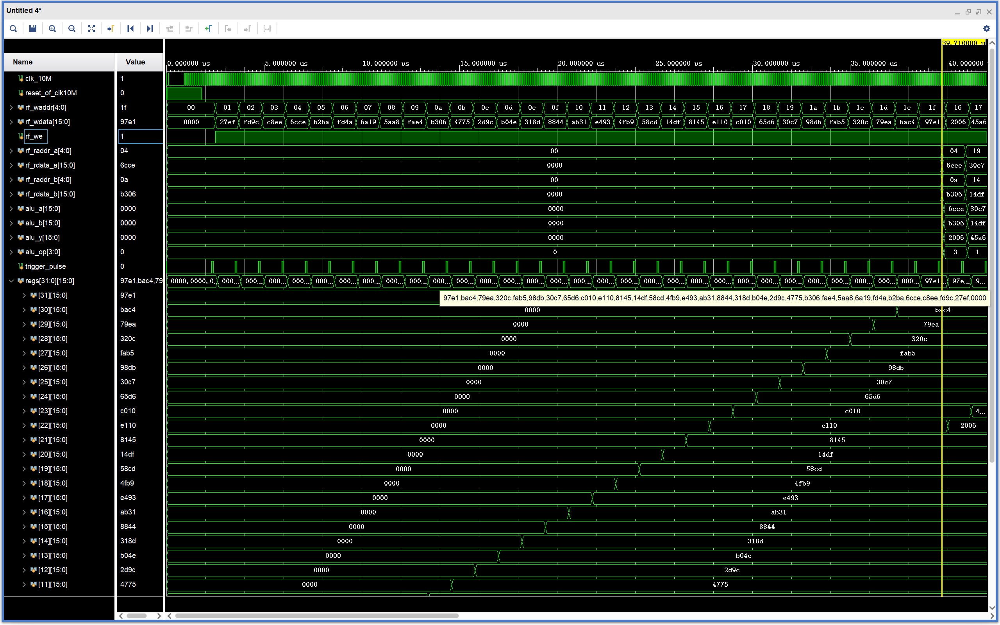
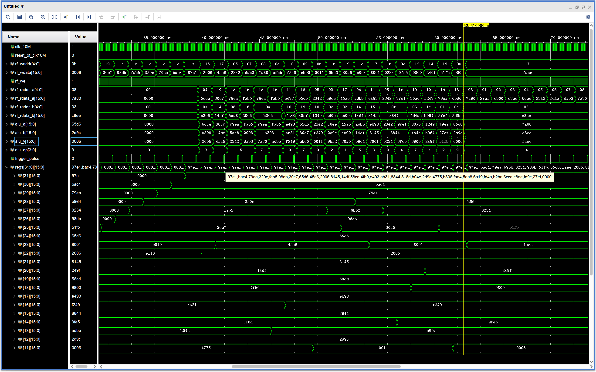
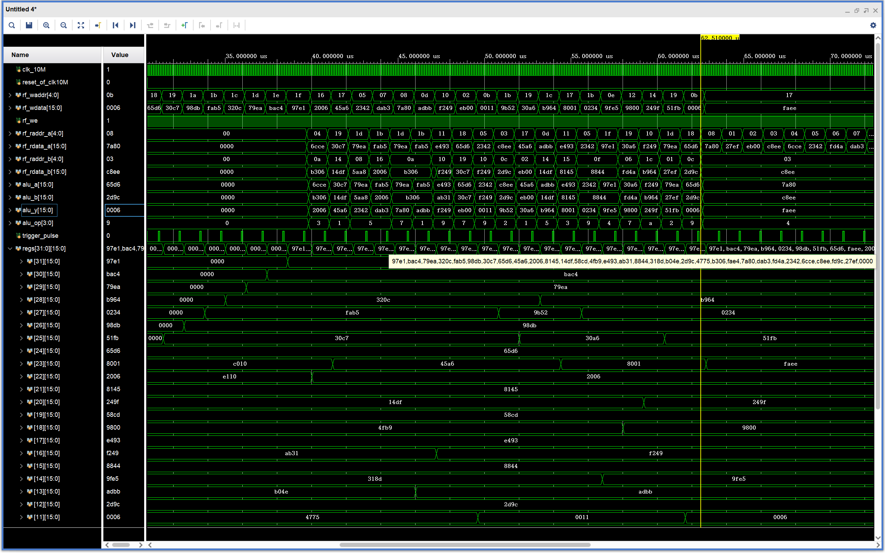
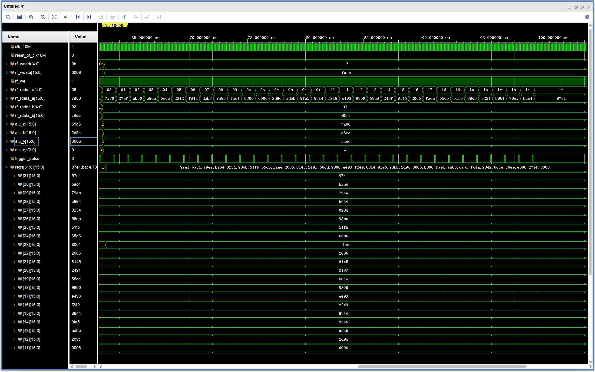
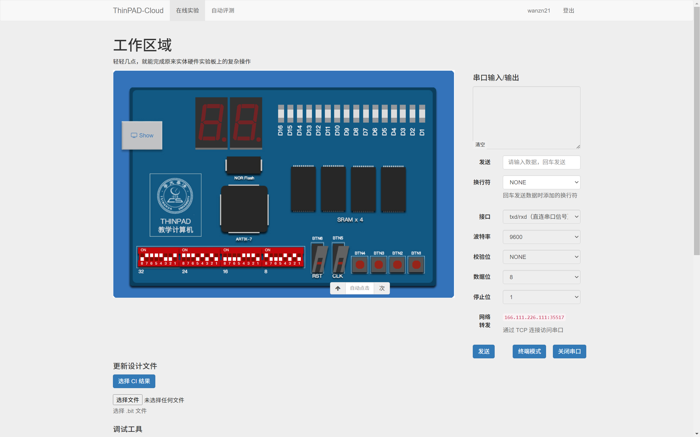
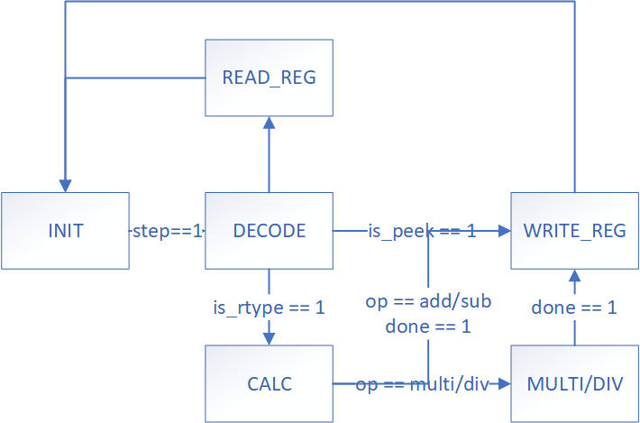

# 实验 2：ALU 与寄存器堆实验

计23 万振南

### 一、仿真波形

我的仿真可以分为三个部分：POKE + 随机 20 条计算指令 + PEEK

**1. POKE**

图1：使用 POKE 指令为寄存器赋随机初值

可以看到寄存器值正确

**2. 随机 20 条计算指令**

图2：第2条计算指令（alu_op=1，加法）

可以看到寄存器 0x19 的值 0x30c7 和寄存器 0x14 的值 0x14df 被读出到 alu_a=0x30c7 和 alu_b=0x14df，加法后得到结果 alu_y=0x45a6，写入寄存器 0x17

图3：第5条计算指令（alu_op=7，逻辑左移）

可以看到寄存器 0x1d 的值 0x79ea 和寄存器 0x0a 的值 0xb306 被读出到 alu_a=0x79ea 和 alu_b=0xb306，逻辑左移后得到结果 alu_y=0x7a80，写入寄存器 0x08

0x79ea=0b0111100111101010
0xb306=0b1011001100000110
取后四位，即0b0110=6，逻辑左移6位
0b0111101010000000=0x7a80

**3. PEEK**

图4：读取各寄存器的值

可以看到寄存器值读取正确

### 二、云平台实验

本次云平台实验可以分为三个部分：POKE + 2 条计算指令 + PEEK

**1. POKE**

图5：将 0xb306=0b1011001100000110，写入寄存器 0x0a=01010

指令：0b1011001100000110_0000_01010_0001_010

图6：将 0x14df=0b0001010011011111，写入寄存器 0x14=10100

指令：0b0001010011011111_0000_10100_0001_010

图7：将 0x30c7=0b0011000011000111，写入寄存器 0x19=11001

指令：0b0011000011000111_0000_11001_0001_010

图8：将 0x79ea=0b0111100111101010，写入寄存器 0x1d=0b11101

指令：0b0111100111101010_0000_11101_0001_010

**2. 2 条计算指令**

图9：对源寄存器 0x14=0b10100 与 0x19=0b11001 中的数据进行加法运算，并将结果写入目标寄存器 0x17=0b10111 中

指令：0b0000000_11001_10100_000_10111_0001_001

计算：
0x30c7=0b0011000011000111 + 0x14df=0b0001010011011111 = 0x45a6=0b0100010110100110

图10：对源寄存器 0x1d=0b11101，逻辑左移 0x0a=0b01010 的后四位，并将结果写入目标寄存器 0x08=0b01000 中

指令：0b0000000_01010_11101_000_01000_0111_001

计算：
0x79ea=0b0111100111101010
0xb306=0b1011001100000110
取后四位，即0b0110=6，逻辑左移6位
0b0111101010000000=0x7a80

**3. PEEK**

图11：读出寄存器 0x17=0b10111 中的数据

指令：0b0000000000000000_0000_10111_0010_010

结果：0b0100010110100110，正确

图12：读出寄存器 0x08=0b01000 中的数据

指令：0b0000000000000000_0000_01000_0010_010

结果：0b0111101010000000，正确

### 三、思考题

ALU 支持乘法和除法运算，而这些运算均不能在一个周期内完成

需要增加一个状态 MULTI/DIV，专门用于乘法和除法，并且增加一个完成信号 done，由该状态控制，计算乘法除法时设为 0，计算完成后设为 1。只有当 done 的值为 1 时，才可以进入到 WRITE_REG 状态。新的状态转移图如下图所示：

图13：新的状态转移图