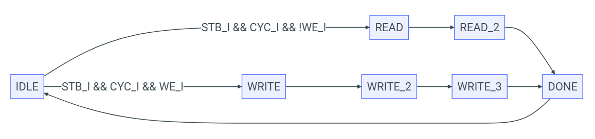
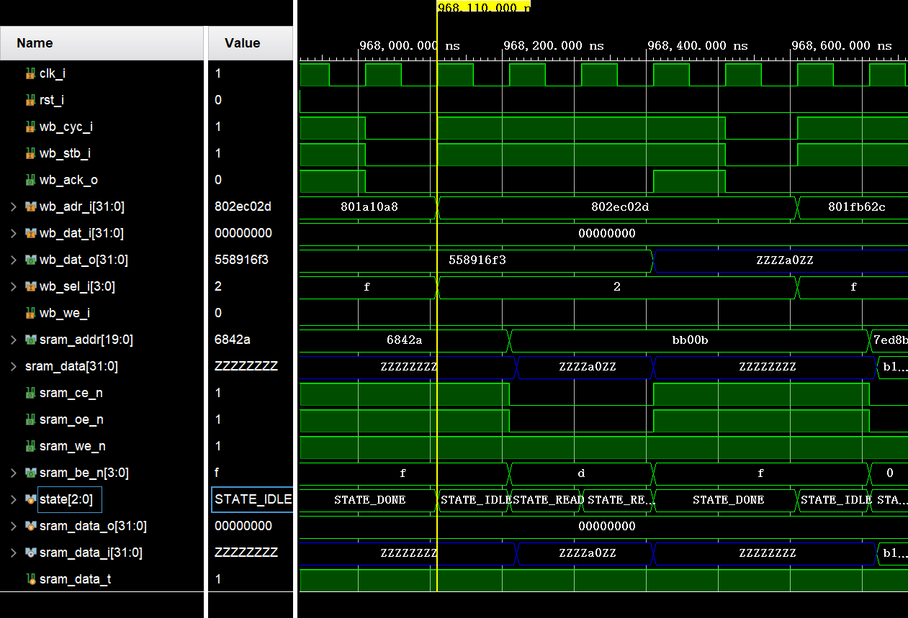
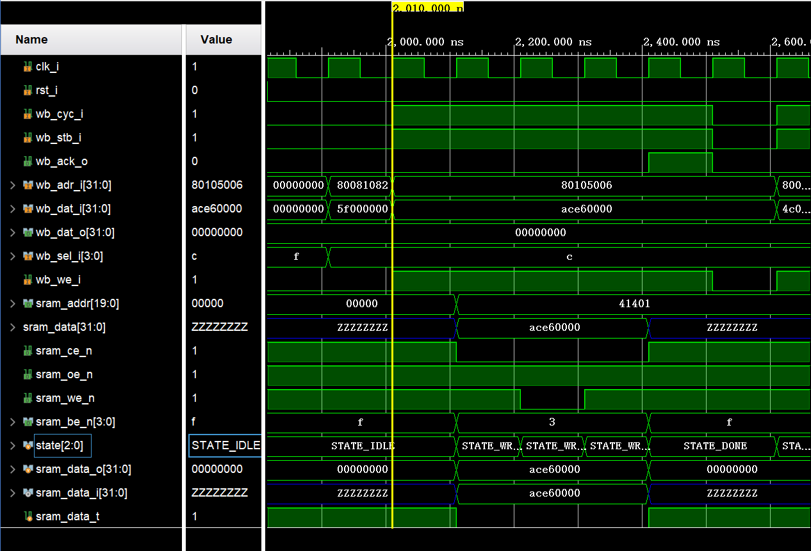
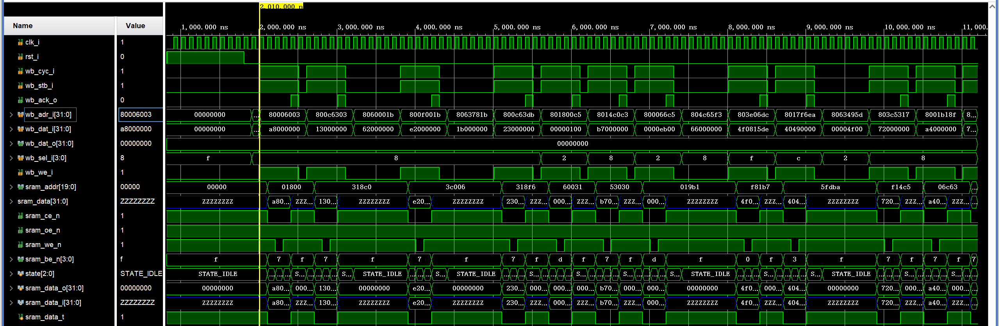
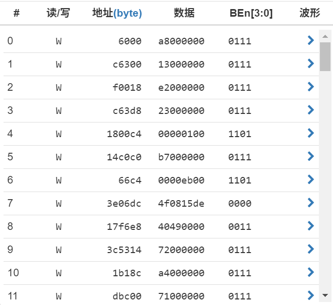
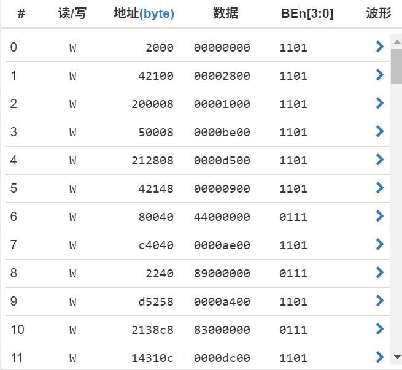

# 实验3 总线实验之 SRAM 控制器实验

计23 万振南

### 一、给出你的 SRAM 状态机设计，并解释每个状态对应的功能

**状态机设计**

在 SystemVerilog 代码中，通过以下定义来表示这些状态：

```sv
typedef enum logic [2:0] {
    STATE_IDLE    = 3'd0,
    STATE_READ    = 3'd1,
    STATE_READ_2  = 3'd2,
    STATE_WRITE   = 3'd3,
    STATE_WRITE_2 = 3'd4,
    STATE_WRITE_3 = 3'd5,
    STATE_DONE    = 3'd6
} state_t;
```


**功能说明**

1. **STATE_IDLE**
- 在该状态下，控制器处于空闲状态，等待 Master 发起请求
- 当 STB_I 和 CYC_I 信号均为高时，表示有新的请求。根据 WE_I 信号判断是读还是写操作，然后转移到 STATE_READ 或 STATE_WRITE

2. **STATE_READ**
- 控制器进入该状态时开始处理读操作
- 设置 SRAM 的地址信号 ce_n 和使能信号 oe_n，准备读取数据
- 状态在下一个时钟周期转移到 STATE_READ_2

3. **STATE_READ_2**
- 从 SRAM 中实际读取数据并保存到寄存器中
- 设置 ACK_O 为高，通知 Master 数据已准备好
- 然后转移到 STATE_DONE 状态以结束操作

4. **STATE_WRITE**
- 进入此状态时，控制器开始处理写操作
- 设置 SRAM 的地址信号和待写入的数据，并将 SRAM 设置为写入模式，we_n 置为高
- 状态在下一个时钟周期转移到 STATE_WRITE_2

5. **STATE_WRITE_2**
- 将写使能信号 we_n 置为低，开始执行写入操作
- 状态在下一个时钟周期转移到 STATE_WRITE_3

6. **STATE_WRITE_3**
- 将写使能信号恢复为高，结束写入操作
- 设置 ACK_O 为高，表示写入完成
- 然后转移到 STATE_DONE 状态

7. **STATE_DONE**
- 在该状态中，控制器完成当前请求，将 ACK_O 置为低
- 等待 STB_I 或 CYC_I 变为低，表示 Master 已结束当前事务
- 最终返回到 STATE_IDLE 状态，准备处理下一个请求

### 二、设定一个随机种子进行仿真，给出部分仿真波形，初步说明设计的正确性

将随机种子设置为 0x3



图1：一次读操作

1. 第一个周期：master 设置 CYC_I=1, STB_I=1, WE_I=0，此时状态是 IDLE，下一个状态是 READ
2. 第二个周期：按照要求输出 addr, oe_n=0, ce_n=0, we_n=1, 根据 SEL_I=0b1111 可知四个字节都要读取，所以输出 be_n=0b0000，此时状态是 READ，下一个状态是 READ_2
3. 第三个周期：这时候 SRAM 返回了数据，把数据保存到寄存器中，此时状态是 READ_2，下一个状态是 DONE
4. 第四个周期：输出 ce_n=1, oe_n=1 让 SRAM 恢复空闲状态，设置 ACK_O=1，此时请求完成，状态是 DONE，下一个状态是 IDLE



图2：一次写操作

1. 第一个周期：master 设置 CYC_I=1, STB_I=1, WE_I=1，此时状态是 IDLE，下一个状态是 WRITE
2. 第二个周期：按照要求输出 addr, data, oe_n=1, ce_n=0, we_n=1，根据 SEL_I=0b1111 可知四个字节都要写入，所以输出 be_n=0b0000，此时状态是 WRITE，下一个状态是 WRITE_2
3. 第三个周期：按照要求输出 we_n=0，此时状态是 WRITE_2，下一个状态是 WRITE_3
4. 第四个周期：按照要求输出 we_n=1，此时状态是 WRITE_3，下一个状态是 DONE
5. 第五个周期：输出 ce_n=1 让 SRAM 恢复空闲状态，设置 ACK_O=1，此时请求完成，状态是 DONE，下一个状态是 IDLE

### 三、在云平台上使用与第 2 步中相同的种子进行实验，使用云平台工具记录前 20 次读写操作，与仿真结果进行比较

将随机种子设置为 0x3：



图3：仿真结果（随机种子0x3）



图4：云平台实验结果（随机种子0x3）

仿真结果和云平台实验结果相同，说明设计的正确性

将随机种子设置为 0x1：



图5：云平台实验结果（随机种子0x1）

云平台实验结果和实验文档相同，说明设计的正确性

### 四、回答思考题

**1. 静态存储器的读和写各有什么特点？**

读：

- 在读操作中，地址信号被送到存储器的地址总线，然后需要一些时间进行地址译码。地址稳定后，存储器开始输出数据
- 静态存储器在读操作中，需要一段时间来稳定数据输出，这段时间包括地址建立时间、读使能信号有效时间等
- 由于静态存储器是同步存储器，它的读操作通常是依赖于时钟信号的。在读周期中，当时钟信号到达时，存储器将输出数据

写：

- 在写操作中，首先将地址信号送到存储器的地址总线，然后将待写入的数据送到数据总线，并使写使能信号有效
- 写操作通常需要更长的时间，因为在写入的过程中，需要将数据写入到指定的存储单元中，并且需要写稳定时间
- 和读操作一样，写操作也依赖于时钟信号。在写周期中，当时钟信号到达时，存储器将数据写入指定的地址

**2. 什么是 RAM 芯片输出的高阻态？它的作用是什么？**

RAM 芯片的输出高阻态意味着芯片的输出端口处于一种高电阻状态，相当于断开状态。在这种状态下，RAM 芯片的输出不会驱动任何信号线，也不会影响其他设备的正常工作。输出线既不被拉高，也不被拉低

作用：

- 高阻态允许多路器、总线仲裁等电路在同一条总线上连接多个设备。在总线系统中，当某个设备不需要输出数据时，它会进入高阻态，这样可以避免多个设备同时驱动总线，防止总线冲突
- 高阻态也用于芯片选择的逻辑中，当芯片未被选中时，其输出将进入高阻态，确保不会干扰其他被选中设备的正常数据输出
- 当设备处于高阻态时，它不会消耗不必要的功耗，因为输出级处于不工作状态，这有助于节能

**3. 本实验完成的是将 BaseRAM 和 ExtRAM 作为独立的存储器单独进行访问的功能。如果希望将 Base_RAM 和 Ext_RAM 作为一个统一的 64 位数据的存储器进行访问，该如何进行？**

并行连接：

- 将 Base_RAM 和 Ext_RAM 的数据总线并行连接，以实现 64 位的宽数据总线，Base_RAM 连接低 32 位，Ext_RAM 连接高 32 位

- 地址总线和控制信号可以保持一致，确保对两个存储器的同步访问

地址映射：

- 在统一的地址空间下，需要对地址进行调整

- 由于 Base_RAM 和 Ext_RAM 分别是独立的 32 位存储器，需要在地址解码时将其映射到不同的存储区间，低 32 位的存储范围对应 Base_RAM，高 32 位的存储范围对应 Ext_RAM

数据总线的扩展：

- 在处理器端，需要将两个 32 位数据合并为一个 64 位数据进行读写
- 读操作时，需要同时从 Base_RAM 和 Ext_RAM 读取数据，并将其组合成一个 64 位数据返回
- 写操作时，需要将 64 位数据分成两部分，分别写入 Base_RAM 和 Ext_RAM