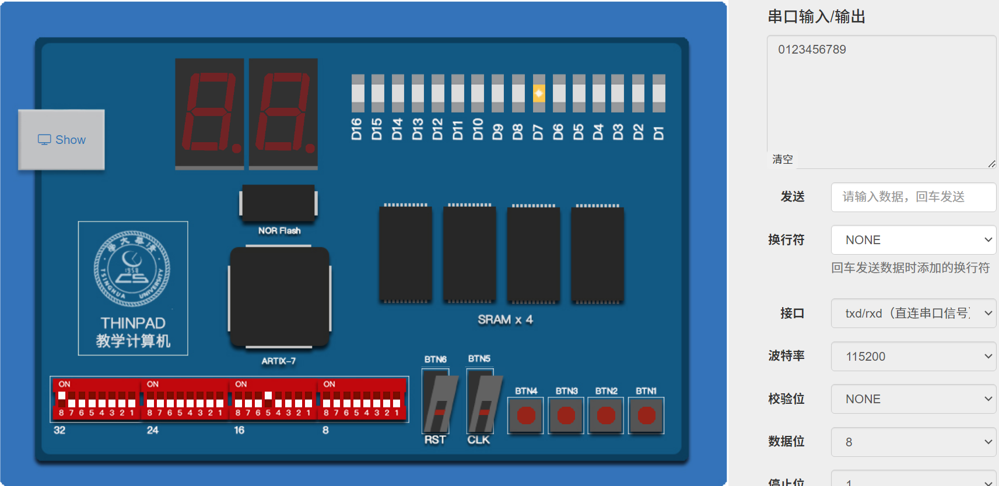

# 实验4 总线实验之 SRAM 控制器实验

计23 万振南

### 一、给出你的状态机设计，并简要解释每个状态的功能

在 SystemVerilog 代码中，通过以下定义来表示这些状态：

```sv
typedef enum logic [3:0] {
    IDLE = 0,
    READ_WAIT_ACTION = 1,
    READ_WAIT_CHECK = 2,
    READ_DATA_ACTION = 3,
    READ_DATA_DONE = 4,
    WRITE_SRAM_ACTION = 5,
    WRITE_SRAM_DONE = 6,
    WRITE_WAIT_ACTION = 7,
    WRITE_WAIT_CHECK = 8,
    WRITE_DATA_ACTION = 9,
    WRITE_DATA_DONE = 10
} state_t;
```

**功能说明**

1. IDLE: 空闲状态，初始状态，在此状态下，设置访问的地址并发起读操作（STB_O = 1, CYC_O = 1）

2. READ_WAIT_ACTION: 处于等待读取的状态，等待从外设或内存获取 ACK 信号确认请求完成。如果收到 ACK 信号，则保存数据并将 CYC_O 置 0

3. READ_WAIT_CHECK: 检查读取的数据是否符合条件，如果符合条件，发起下一步的读操作

4. READ_DATA_ACTION: 在这个状态中开始实际读取数据，等待外设响应 ACK 信号。若响应，则记录读取的数据并清除相关信号

5. READ_DATA_DONE: 读操作完成后，将目标地址和读取到的数据准备好，进入写操作的状态

6. WRITE_SRAM_ACTION: 启动写操作，将数据写入到 SRAM 中。设定写地址、数据并置位 CYC_O 和 WE_O，等待 ACK 信号

7. WRITE_SRAM_DONE: 写入完成后，进入到写等待状态，设置要检查的地址

8. WRITE_WAIT_ACTION: 等待从外设或内存返回的 ACK 信号，类似于读取等待状态。成功后，进入写检查状态

9. WRITE_WAIT_CHECK: 根据收到的数据进行检查，如果特定位（信号 bit 5）满足要求，继续写入数据，否则返回空闲状态

10. WRITE_DATA_ACTION: 实际开始写数据，等待外设或内存响应 ACK 信号确认写入成功

11. WRITE_DATA_DONE: 写操作完成后，更新地址寄存器和数据计数器，以准备下一个数据块的操作，如果达到指定次数，则保持该状态，否则返回空闲状态


### 二、进行仿真，给出仿真波形，初步验证设计的正确性

仿真代码
```sv
dip_sw = 32'h8000_1000;

for (integer j = 0; j < 10; j = j + 1) begin
    uart.pc_send_byte(8'h30 + j);
    #10000;
end
```


图1：仿真总览

十个数据均成功读取写入，说明设计的正确性


图2：仿真波形

从左至右依次是 READ_WAIT_ACTION, READ_WAIT_CHECK, READ_DATA_ACTION, READ_DATA_DONE, WRITE_SRAM_ACTION, WRITE_SRAM_DONE, WRITE_WAIT_ACTION, WRITE_WAIT_CHECK, WRITE_DATA_ACTION, WRITE_DATA_DONE, IDLE 这十一个状态，波形正确，说明设计的正确性

### 三、上板进行实验，给出实验过程截图，验证设计的正确性。注意不是 OJ 通过截图




图3：实验过程截图

输入/输出：'0123456789'，读取数据正确，说明设计的正确性

### 四、回答思考题

**阅读 Wishbone UART 控制器的代码，体会 MMIO 寄存器的概念。映射到地址空间上的“内存”的内容一定是只受 Master 端控制的吗？如何将数码管和拨码开关也映射到地址空间上？**

在 Wishbone UART 控制器中，MMIO（内存映射 I/O）寄存器通过地址空间来映射 UART 控制寄存器，使得主设备（如 CPU）可以通过读写这些地址来与设备通信。但映射到地址空间的内存内容不一定仅由主设备控制。MMIO 允许外设（如 UART 控制器）通过异步通信协议主动更新寄存器状态，这表明 MMIO 映射的内存可以受到从设备影响

为了将数码管和拨码开关映射到地址空间，可以设计类似 UART 控制器的 MMIO 接口，将数码管的数据输入输出和拨码开关的状态读入寄存器，并将这些寄存器通过 Wishbone 总线映射到主设备的地址空间，使得主设备可以通过 MMIO 访问和控制这些外设