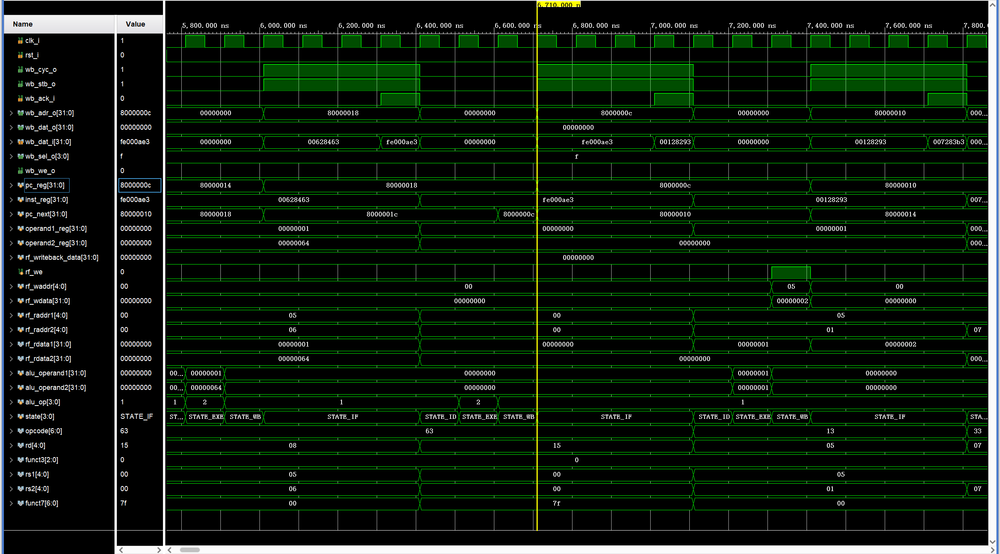
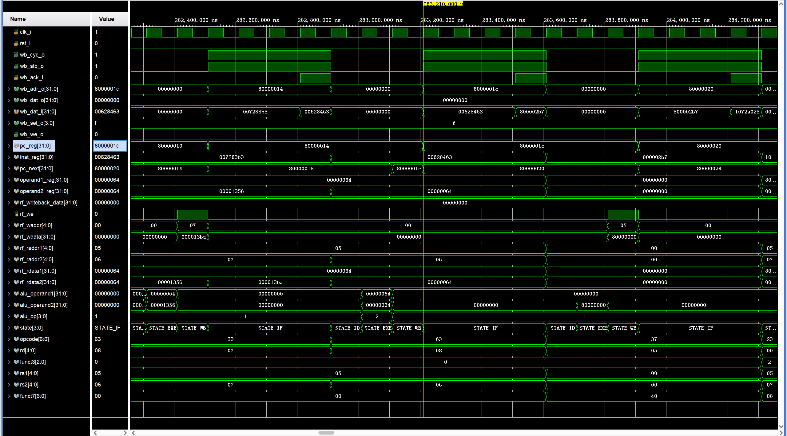
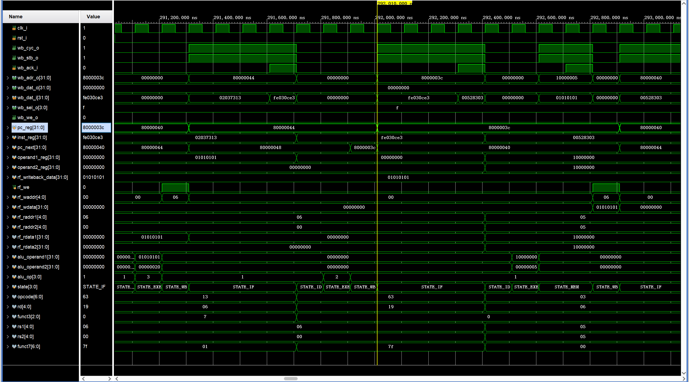
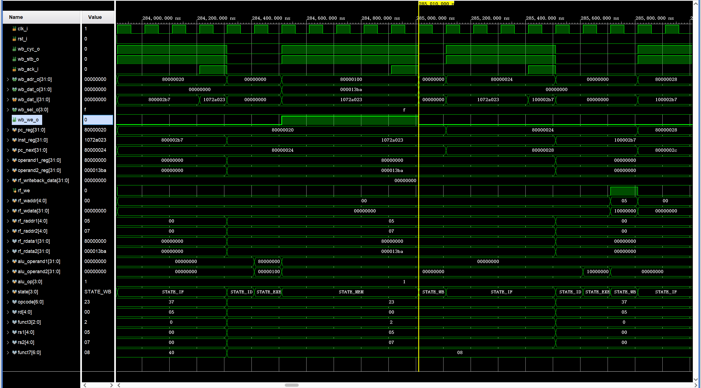
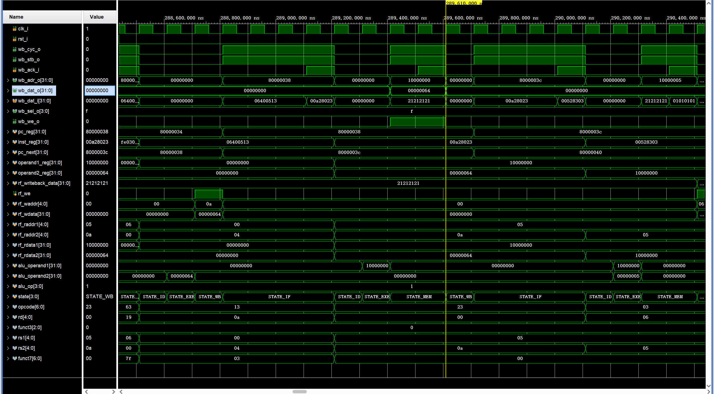
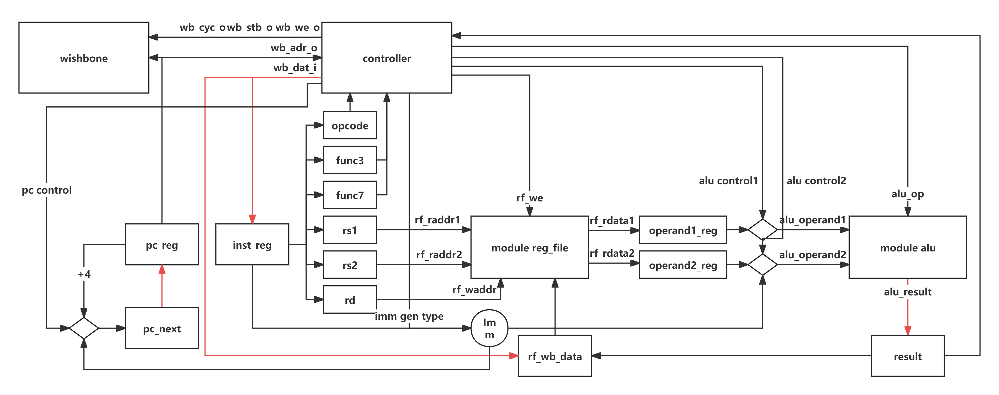
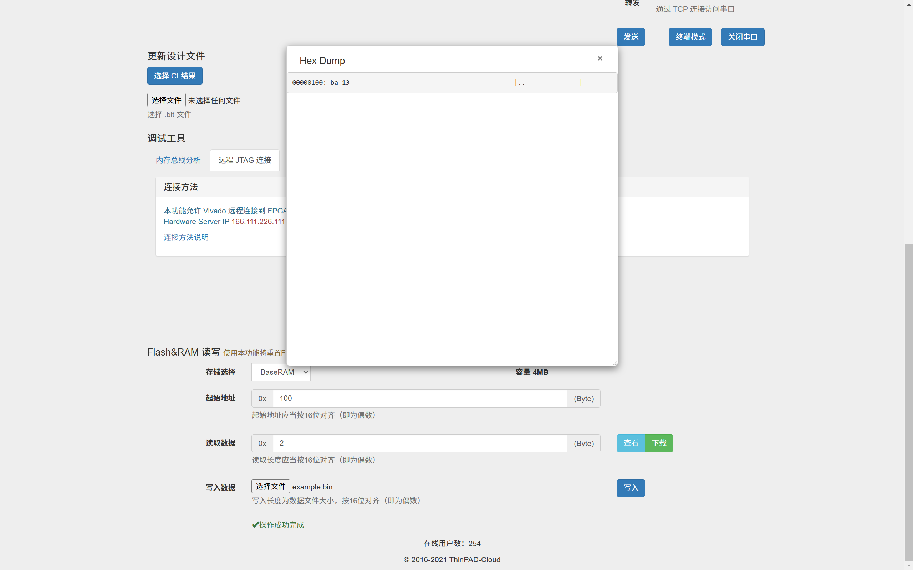
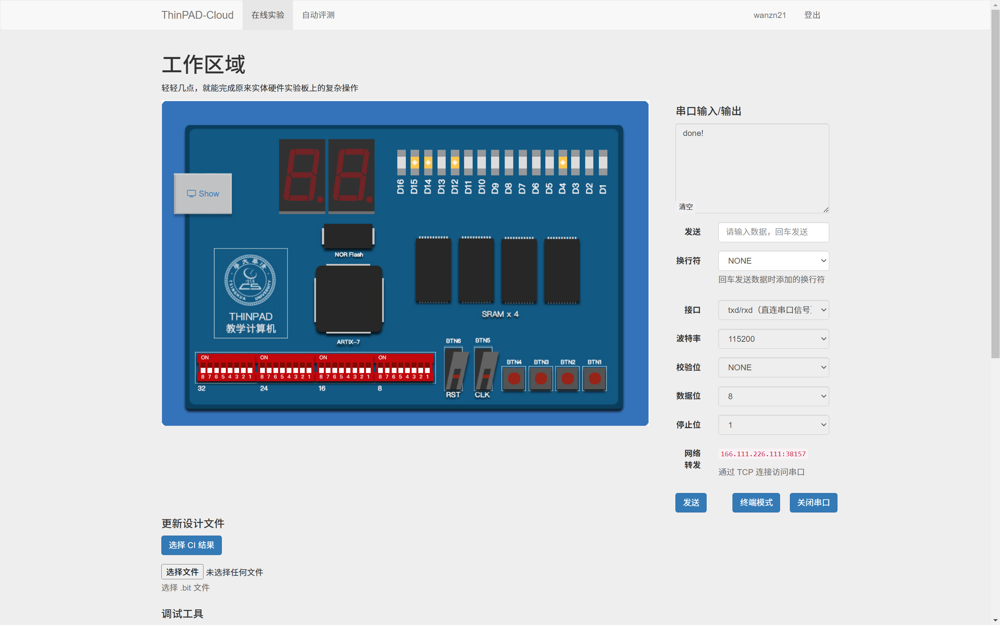

# 实验5 处理器实验

计23 万振南

## 一、仿真

### 1. 跳转

图1-1：指令`beq zero, zero, loop`跳转时波形图

pc 从 0x80000018 正确跳转到 0x8000000c

图1-2：指令`beq t0, t1, next`跳转时波形图

pc 从 0x80000014 正确跳转到 0x8000001c

图1-3：指令`beq t1, zero, .TESTW1`跳转时波形图

pc 从 0x80000044 正确跳转到 0x8000003c

上述指令译码情况：

opcode[6:0] = 0x63 = 7'b1100011
func3[2:0] = 0x0 = 3'b000

均译码正确

### 2. 写入内存

图2：指令`sw t2, 0x100(t0)`写入内存时波形图

指令译码情况：

opcode[6:0] = 0x23 = 7'b01000011
func3[2:0] = 0x2 = 3'b010

译码正确

wb_cyc_o, wb_stb_o, wb_we_o 等 Wishbone 信号正常

wb_adr_o 和 wb_dat_o 的值正确

wb_ack_i 为高时，说明数据已经成功写入

### 3. 写入串口

图3：指令`sb a0, 0(t0)`写入内存时波形图

指令译码情况：

opcode[6:0] = 0x23 = 7'b01000011
func3[2:0] = 0x0 = 3'b000

译码正确

wb_cyc_o, wb_stb_o, wb_we_o 等 Wishbone 信号正常

wb_dat_o 的值为 0x00000064 = 100，即'd'的ASCII码

wb_adr_o 和 wb_dat_o 的值正确

能够将'd'成功写入串口

## 二、实验数据

### 1. CPU 结构图

图4：CPU 结构图

### 2. 信号表和状态转移表

**LUI 指令**

信号表：

| 状态       | wb_addr | wb_cyc | rf_raddr_a | rf_raddr_b | imm_gen_type | alu_operand1 | alu_operand2 | alu_op | rf_wen | rf_wdata   | rf_waddr |
|------------|---------|--------|------------|------------|--------------|--------------|--------------|--------|--------|------------|----------|
| STATE_IF   | pc      | 1      | x          | x          | x            | pc           | 32'h4        | ADD    | 0      | x          | x        |
| STATE_ID   | x       | 0      | x          | x          | U            | x            | x            | x      | 0      | x          | x        |
| STATE_EXE  | x       | 0      | x          | x          | x            | 32'b0        | imm_U        | ADD    | 0      | x          | x        |
| STATE_WB   | x       | 0      | x          | x          | x            | x            | x            | x      | 1      | alu_result | rd       |

状态转移和时序：

| 原状态    | 新状态    | 条件       | 时序操作                                             |
|-----------|-----------|------------|------------------------------------------------------|
| STATE_IF  | STATE_IF  | ack == 0   |                                                      |
| STATE_IF  | STATE_ID  | ack == 1   | inst <= wb_data_i; pc_now <= pc; pc <= pc + 4        |
| STATE_ID  | STATE_EXE | TRUE       |                                                      |
| STATE_EXE | STATE_WB  | TRUE       | rf_writeback_data <= alu_result                      |
| STATE_WB  | STATE_IF  | TRUE       |                                                      |

**BEQ 指令**

信号表：

| 状态       | wb_addr | wb_cyc | rf_raddr_a | rf_raddr_b | imm_gen_type | alu_operand1  | alu_operand2  | alu_op | rf_wen | rf_wdata | rf_waddr |
|------------|---------|--------|------------|------------|--------------|---------------|---------------|--------|--------|----------|----------|
| STATE_IF   | pc      | 1      | x          | x          | x            | pc            | 32'h4         | ADD    | 0      | x        | x        |
| STATE_ID   | x       | 0      | rs1        | rs2        | B            | x             | x             | x      | 0      | x        | x        |
| STATE_EXE  | x       | 0      | x          | x          | x            | operand1      | operand2      | SUB    | 0      | x        | x        |
| STATE_WB   | x       | 0      | x          | x          | x            | x             | x             | x      | 0      | x        | x        |

状态转移和时序：

| 原状态    | 新状态    | 条件       | 时序操作                                                    |
|-----------|-----------|------------|-------------------------------------------------------------|
| STATE_IF  | STATE_IF  | ack == 0   |                                                             |
| STATE_IF  | STATE_ID  | ack == 1   | inst <= wb_data_i; pc_now <= pc; pc <= pc + 4               |
| STATE_ID  | STATE_EXE | TRUE       | operand1 <= rf_rdata_a; operand2 <= rf_rdata_b              |
| STATE_EXE | STATE_WB  | TRUE       | rf_writeback_data <= alu_result                             |
| STATE_WB  | STATE_IF  | TRUE       | if (alu_result == 0) pc <= pc_now + imm_gen_imm             |

**LB 指令**

信号表：

| 状态       | wb_addr   | wb_cyc | rf_raddr_a | rf_raddr_b | imm_gen_type | alu_operand1  | alu_operand2 | alu_op | rf_wen | rf_wdata | rf_waddr |
|------------|-----------|--------|------------|------------|--------------|---------------|--------------|--------|--------|----------|----------|
| STATE_IF   | pc        | 1      | x          | x          | x            | pc            | 32'h4        | ADD    | 0      | x        | x        |
| STATE_ID   | x         | 0      | rs1        | x          | I            | x             | x            | x      | 0      | x        | x        |
| STATE_EXE  | x         | 0      | x          | x          | x            | operand1      | imm_I        | ADD    | 0      | x        | x        |
| STATE_MEM  | alu_result| 1      | x          | x          | x            | x             | x            | x      | 0      | x        | x        |
| STATE_WB   | x         | 0      | x          | x          | x            | x             | x            | x      | 1      | wb_dat_i | rd       |

状态转移和时序：

| 原状态    | 新状态    | 条件           | 时序操作                                                    |
|-----------|-----------|----------------|-------------------------------------------------------------|
| STATE_IF  | STATE_IF  | ack == 0       |                                                             |
| STATE_IF  | STATE_ID  | ack == 1       | inst <= wb_data_i; pc_now <= pc; pc <= pc + 4               |
| STATE_ID  | STATE_EXE | TRUE           | operand1 <= rf_rdata_a                                      |
| STATE_EXE | STATE_MEM | TRUE           | mem_addr <= alu_result                       |
| STATE_MEM | STATE_MEM | wb_ack_i == 0  |                                                             |
| STATE_MEM | STATE_WB  | wb_ack_i == 1  | rf_writeback_data <= wb_dat_i                               |
| STATE_WB  | STATE_IF  | TRUE           |                                                             |

**SB 指令**

信号表：

| 状态       | wb_addr   | wb_cyc | rf_raddr_a | rf_raddr_b | imm_gen_type | alu_operand1  | alu_operand2 | alu_op | rf_wen | rf_wdata | rf_waddr |
|------------|-----------|--------|------------|------------|--------------|---------------|--------------|--------|--------|----------|----------|
| STATE_IF   | pc        | 1      | x          | x          | x            | pc            | 32'h4        | ADD    | 0      | x        | x        |
| STATE_ID   | x         | 0      | rs1        | rs2        | S            | x             | x            | x      | 0      | x        | x        |
| STATE_EXE  | x         | 0      | x          | x          | x            | operand1      | imm_S        | ADD    | 0      | x        | x        |
| STATE_MEM  | alu_result| 1      | x          | x          | x            | x             | x            | x      | 0      | x        | x        |
| STATE_WB   | x         | 0      | x          | x          | x            | x             | x            | x      | 0      | x        | x        |

状态转移和时序：

| 原状态    | 新状态    | 条件           | 时序操作                                                    |
|-----------|-----------|----------------|-------------------------------------------------------------|
| STATE_IF  | STATE_IF  | ack == 0       |                                                             |
| STATE_IF  | STATE_ID  | ack == 1       | inst <= wb_data_i; pc_now <= pc; pc <= pc + 4               |
| STATE_ID  | STATE_EXE | TRUE           | operand1 <= rf_rdata_a; operand2 <= rf_rdata_b              |
| STATE_EXE | STATE_MEM | TRUE           | mem_addr <= alu_result                                 |
| STATE_MEM | STATE_MEM | wb_ack_i == 0  |                                                             |
| STATE_MEM | STATE_WB  | wb_ack_i == 1  |                                                             |
| STATE_WB  | STATE_IF  | TRUE           |                                                             |

**SW 指令**

信号表：

| 状态       | wb_addr   | wb_cyc | rf_raddr_a | rf_raddr_b | imm_gen_type | alu_operand1  | alu_operand2 | alu_op | rf_wen | rf_wdata | rf_waddr |
|------------|-----------|--------|------------|------------|--------------|---------------|--------------|--------|--------|----------|----------|
| STATE_IF   | pc        | 1      | x          | x          | x            | pc            | 32'h4        | ADD    | 0      | x        | x        |
| STATE_ID   | x         | 0      | rs1        | rs2        | S            | x             | x            | x      | 0      | x        | x        |
| STATE_EXE  | x         | 0      | x          | x          | x            | operand1      | imm_S        | ADD    | 0      | x        | x        |
| STATE_MEM  | alu_result| 1      | x          | x          | x            | x             | x            | x      | 0      | x        | x        |
| STATE_WB   | x         | 0      | x          | x          | x            | x             | x            | x      | 0      | x        | x        |

状态转移和时序：

| 原状态    | 新状态    | 条件           | 时序操作                                                    |
|-----------|-----------|----------------|-------------------------------------------------------------|
| STATE_IF  | STATE_IF  | ack == 0       |                                                             |
| STATE_IF  | STATE_ID  | ack == 1       | inst <= wb_data_i; pc_now <= pc; pc <= pc + 4               |
| STATE_ID  | STATE_EXE | TRUE           | operand1 <= rf_rdata_a; operand2 <= rf_rdata_b              |
| STATE_EXE | STATE_MEM | TRUE           | alu_result <= operand1 + imm_gen_imm                        |
| STATE_MEM | STATE_MEM | wb_ack_i == 0  |                                                             |
| STATE_MEM | STATE_WB  | wb_ack_i == 1  |                                                             |
| STATE_WB  | STATE_IF  | TRUE           |                                                             |

**ADDI 指令**

信号表：

| 状态       | wb_addr | wb_cyc | rf_raddr_a | rf_raddr_b | imm_gen_type | alu_operand1 | alu_operand2 | alu_op | rf_wen | rf_wdata   | rf_waddr |
|------------|---------|--------|------------|------------|--------------|--------------|--------------|--------|--------|------------|----------|
| STATE_IF   | pc      | 1      | x          | x          | x            | pc           | 32'h4        | ADD    | 0      | x          | x        |
| STATE_ID   | x       | 0      | rs1        | x          | I            | x            | x            | x      | 0      | x          | x        |
| STATE_EXE  | x       | 0      | x          | x          | x            | operand1     | imm_I        | ADD    | 0      | x          | x        |
| STATE_WB   | x       | 0      | x          | x          | x            | x            | x            | x      | 1      | alu_result | rd       |

状态转移和时序：

| 原状态    | 新状态    | 条件       | 时序操作                                             |
|-----------|-----------|------------|------------------------------------------------------|
| STATE_IF  | STATE_IF  | ack == 0   |                                                      |
| STATE_IF  | STATE_ID  | ack == 1   | inst <= wb_data_i; pc_now <= pc; pc <= pc + 4        |
| STATE_ID  | STATE_EXE | TRUE       | operand1 <= rf_rdata_a                               |
| STATE_EXE | STATE_WB  | TRUE       | rf_writeback_data <= alu_result                      |
| STATE_WB  | STATE_IF  | TRUE       |                                                      |

**ANDI 指令**

信号表：

| 状态       | wb_addr | wb_cyc | rf_raddr_a | rf_raddr_b | imm_gen_type | alu_operand1 | alu_operand2 | alu_op | rf_wen | rf_wdata   | rf_waddr |
|------------|---------|--------|------------|------------|--------------|--------------|--------------|--------|--------|------------|----------|
| STATE_IF   | pc      | 1      | x          | x          | x            | pc           | 32'h4        | ADD    | 0      | x          | x        |
| STATE_ID   | x       | 0      | rs1        | x          | I            | x            | x            | x      | 0      | x          | x        |
| STATE_EXE  | x       | 0      | x          | x          | x            | operand1     | imm_I        | AND    | 0      | x          | x        |
| STATE_WB   | x       | 0      | x          | x          | x            | x            | x            | x      | 1      | alu_result | rd       |

状态转移和时序：

| 原状态    | 新状态    | 条件       | 时序操作                                             |
|-----------|-----------|------------|------------------------------------------------------|
| STATE_IF  | STATE_IF  | ack == 0   |                                                      |
| STATE_IF  | STATE_ID  | ack == 1   | inst <= wb_data_i; pc_now <= pc; pc <= pc + 4        |
| STATE_ID  | STATE_EXE | TRUE       | operand1 <= rf_rdata_a                               |
| STATE_EXE | STATE_WB  | TRUE       | rf_writeback_data <= alu_result                      |
| STATE_WB  | STATE_IF  | TRUE       |                                                      |

**ADD 指令**

信号表：

| 状态       | wb_addr | wb_cyc | rf_raddr_a | rf_raddr_b | imm_gen_type | alu_operand1 | alu_operand2 | alu_op | rf_wen | rf_wdata   | rf_waddr |
|------------|---------|--------|------------|------------|--------------|--------------|--------------|--------|--------|------------|----------|
| STATE_IF   | pc      | 1      | x          | x          | x            | pc           | 32'h4        | ADD    | 0      | x          | x        |
| STATE_ID   | x       | 0      | rs1        | rs2        | x            | x            | x            | x      | 0      | x          | x        |
| STATE_EXE  | x       | 0      | x          | x          | x            | operand1     | operand2     | ADD    | 0      | x          | x        |
| STATE_WB   | x       | 0      | x          | x          | x            | x            | x            | x      | 1      | alu_result | rd       |

状态转移和时序：

| 原状态    | 新状态    | 条件       | 时序操作                                             |
|-----------|-----------|------------|------------------------------------------------------|
| STATE_IF  | STATE_IF  | ack == 0   |                                                      |
| STATE_IF  | STATE_ID  | ack == 1   | inst <= wb_data_i; pc_now <= pc; pc <= pc + 4        |
| STATE_ID  | STATE_EXE | TRUE       | operand1 <= rf_rdata_a; operand2 <= rf_rdata_b       |
| STATE_EXE | STATE_WB  | TRUE       | rf_writeback_data <= alu_result                      |
| STATE_WB  | STATE_IF  | TRUE       |                                                      |

### 3. 内存数据截图

图5：内存数据截图

### 4. 串口输出截图

图6：串口输出截图

### 三、思考题

**1. 流水线 CPU 中，用于 branch 指令的比较器既可以放在 ID 阶段，也可以放在 EXE 阶段。放在这两个阶段分别有什么优缺点？**

放在 ID 阶段

优点：

提前确定分支结果，减少分支延迟：在 ID 阶段进行比较，可以更早地确定分支是否成立。如果分支需要跳转，可以提前知道，从而减少错误取指令的数量，降低分支惩罚，提高流水线效率
降低流水线冲刷的代价：由于在 ID 阶段就确定了分支结果，可以减少需要冲刷流水线的指令数量，减少由错误预测带来的性能损失

缺点：

数据冒险处理复杂化：在 ID 阶段，源操作数可能还未准备就绪，尤其是当前指令依赖于前面尚未完成的指令结果时。这需要增加数据转发或插入气泡等机制来解决数据冒险，增加了硬件复杂度
增加 ID 阶段的负担：在 ID 阶段增加比较逻辑，会使该阶段的电路复杂度提高，可能影响指令译码的速度，并增加设计和实现的难度

放在 EXE 阶段

优点：

操作数可用性高：在 EXE 阶段，源操作数通常已经通过数据转发或寄存器读取等方式准备就绪，比较器可以直接对操作数进行计算，避免了在 ID 阶段可能遇到的数据未就绪问题
硬件设计更简单：将比较器放在 EXE 阶段，避免在 ID 阶段加入复杂的比较和决策逻辑，降低了 ID 阶段的复杂度，简化了整体设计

缺点：

分支决策延迟增加：直到 EXE 阶段才能确定分支是否跳转，此时流水线中可能已经取指和译码了多条后续指令。如果分支需要跳转，这些指令必须被冲刷，增大了分支惩罚，降低了流水线效率
增加流水线停顿周期：由于分支决策的延迟，可能需要在 EXE 阶段之前插入停顿，以防止错误的指令执行。这会导致流水线停顿，影响指令吞吐量